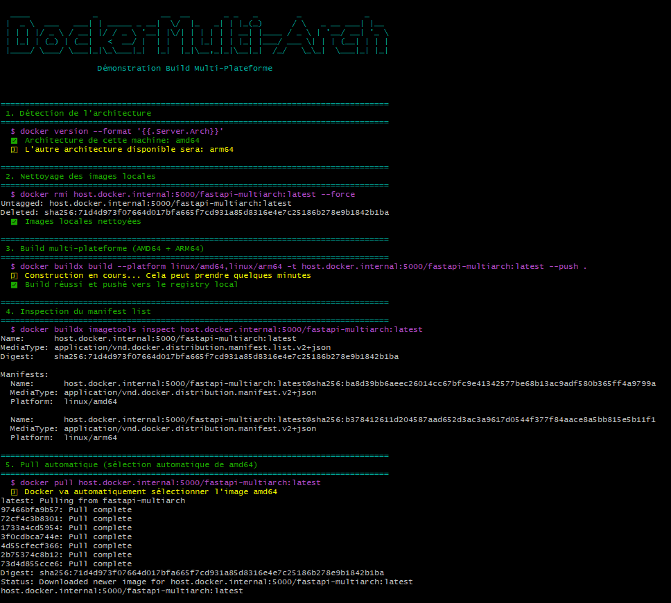
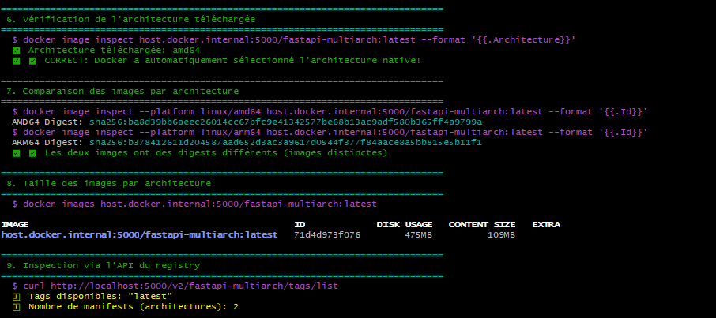

# Docker buildx

Démonstration de build multi-plateformes / archi : **amd64** (x86) et **arm64** (M1/M2, Rasberry, AWS Graviton), pour ne produire qu'une seule référence (**fastapi-multiarch**) d'image OCI contenant 

- 1 manifest list qui référence 2 manifests correspondant à chacune des architectures de l'image
- 1 manifest amd64 qui liste les layers correspondants à l'image AMD64
- 1 manifest arm64 qui liste les layers correspondants à l'image ARM64

## Prérequis 

**Buildx**

```
$ docker buildx version
github.com/docker/buildx v0.30.1-desktop.1 792b8327a475a5d8c9d5f4ea6ce866e7da39ae8b
```

**Création d'un builder**

```bash
docker buildx rm multiarch-builder
docker buildx create --name multiarch-builder --driver docker-container --config ./buildkitd.toml --use
```

Le [buildkitd.toml](buildkitd.toml) permet au builder d'utiliser http (sans certificats TLS) sur le FQDN local et port 5000 du registry interne : **host.docker.internal**

**Registry local**

Pour plus de facilité, un registry local doit exister, pour le --push vers celui-ci lors du build de l'image multi-architectures

Le [registry.yml](registry.yml) est le compose de ce registry, lancé avant le build pour pouvoir pusher.

```
$ docker compose -f registry2.yml up -d
```

NB : il est possible de directement mettre dans le **daemon.json** des règles d'exception pour indiquer les serveurs registry en accès non sécurisé :

```json
{
  "insecure-registries": ["host.docker.internal:5000", "localhost:5000"]
}
```

ou de créer un TLS auto-signé.

## Build multi-archi

Crée une image fastapi sur pour 2 architecteurs simultanément.

```bash
$ docker buildx build --platform linux/amd64,linux/arm64 \
  -t host.docker.internal:5000/fastapi-multiarch:latest \
  -f Dockerfile.fastapi \
  --push \
  --build-arg BUILDKIT_INLINE_CACHE=1 \
  .
```

## Pull de l'image

Lors du pull de l'image (docker pull), docker détecte l'architecture utilisée sur le poste qui effectue le pull et envoi uniquement l'image correspondante : 

```bash
$ docker pull host.docker.internal:5000/fastapi-multiarch:latest
latest: Pulling from fastapi-multiarch
Digest: sha256:71d4d973f07664d017bfa665f7cd931a85d8316e4e7c25186b278e9b1842b1ba
Status: Image is up to date for host.docker.internal:5000/fastapi-multiarch:latest
host.docker.internal:5000/fastapi-multiarch:latest
```

Si on force un pull sur une architecture non supportée par la machine qui crée le build, une erreur d'exécution aura lieu 

Exemple : ARM alors que seul l'AMD fonctionne sur mon poste 

```bash
$ docker pull --platform linux/arm64 host.docker.internal:5000/fastapi-multiarch:latest
```

Exécution de l'image fastapi -> cela ne fonctionne pas sur une archi AMD64 (x86)

```bash
$ docker run --rm -p 80:80 fastapi-multiarch:amd64
WARNING: The requested image's platform (linux/arm64) does not match the detected host platform (linux/amd64/v3) and no specific platform was requested
exec /usr/local/bin/uvicorn: exec format error
```

## Inspection des manifests de l'image 

Le manifest list (sha256:71d4d973f0...) indique 2 manifests :

- un pour l'amd64 (sha256:ba8d39b...)
- un pour l'arm64 (sha256:b378412...)

```bash
 $ docker buildx imagetools inspect  host.docker.internal:5000/fastapi-multiarch:latest
Name:      host.docker.internal:5000/fastapi-multiarch:latest
MediaType: application/vnd.docker.distribution.manifest.list.v2+json
Digest:    sha256:71d4d973f07664d017bfa665f7cd931a85d8316e4e7c25186b278e9b1842b1ba

Manifests:
  Name:      host.docker.internal:5000/fastapi-multiarch:latest@sha256:ba8d39bb6aeec26014cc67bfc9e41342577be68b13ac9adf580b365ff4a9799a
  MediaType: application/vnd.docker.distribution.manifest.v2+json
  Platform:  linux/amd64

  Name:      host.docker.internal:5000/fastapi-multiarch:latest@sha256:b378412611d204587aad652d3ac3a9617d0544f377f84aace8a5bb815e5b11f1
  MediaType: application/vnd.docker.distribution.manifest.v2+json
  Platform:  linux/arm64
```

## Webapp

Après un build, pull de l'image précédemment construite

```bash
$ docker pull host.docker.internal:5000/fastapi-multiarch:latest
```

On pourrait forcer :

```bash
$ docker pull --platform linux/amd64 host.docker.internal:5000/fastapi-multiarch:latest
```

Exécution de fastapi

```bash
$ docker run --rm -p 80:80 host.docker.internal:5000/fastapi-multiarch
INFO:     Started server process [1]
INFO:     Waiting for application startup.
INFO:     Application startup complete.
INFO:     Uvicorn running on http://0.0.0.0:80 (Press CTRL+C to quit)
```

en allant sur http://localhost/arch :
```json
{
architecture: "x86_64"
}
```

## Script de démo 

Il déroulera les commandes docker pour builder, puller, et inspecter les images produites.

```bash
$ ./multi-arch.sh
```




